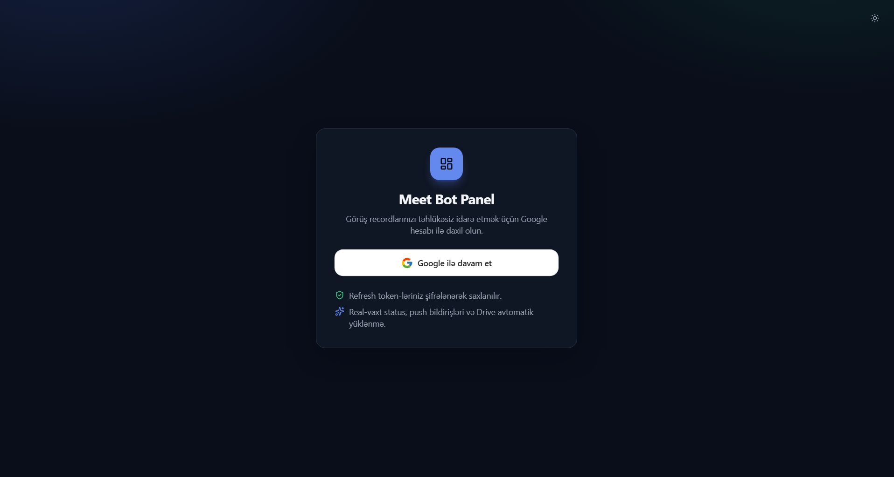
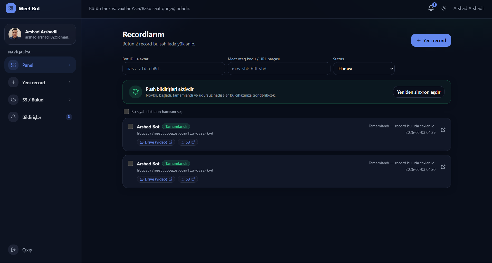
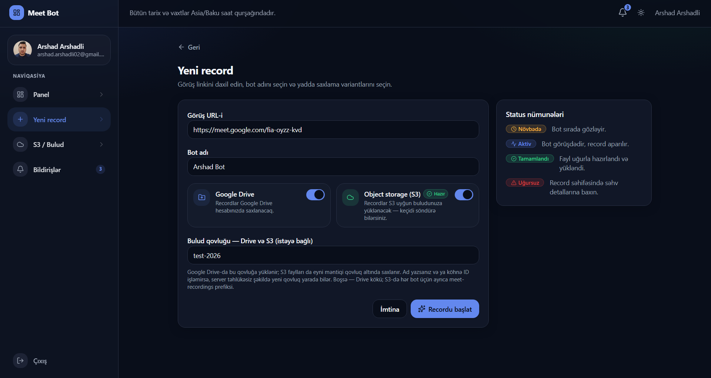
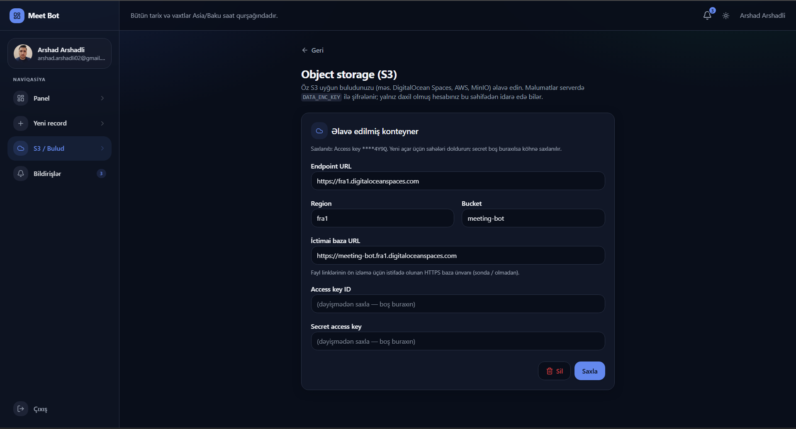
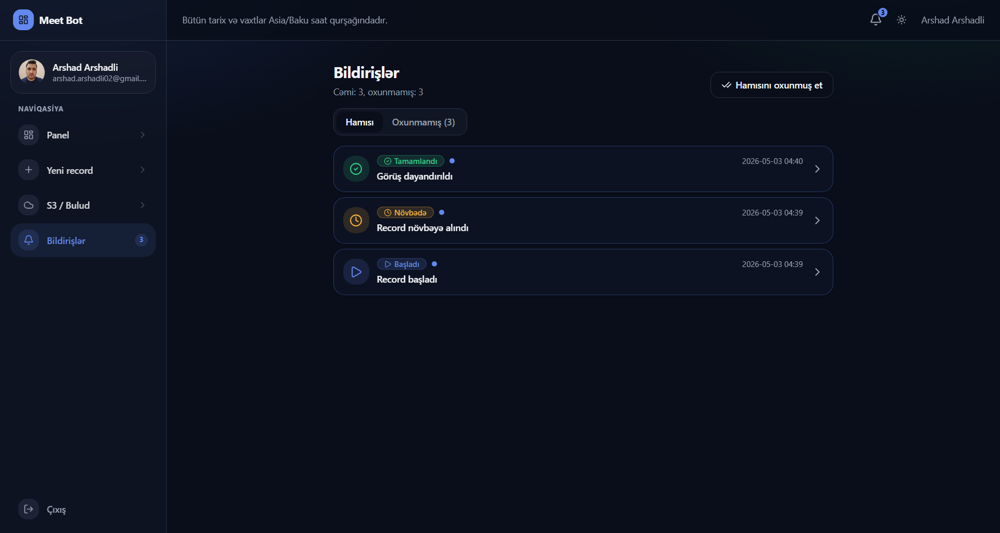

# meet-bot

Google Meet recorder. Three independent apps — API, worker, dashboard — each with its own dependencies and Dockerfile. No npm workspaces, no shared root `node_modules`.

```
meet-bot/
  apps/
    api/         Fastify HTTP API (port 3000)
    worker/      BullMQ consumer + Playwright + ffmpeg recorder
    dashboard/   Next.js UI (port 4000)
  postman/       Postman collection for testing the API
  docker-compose.yml
  .env.example
```

Each app is fully self-contained: copy `apps/api/` (or `apps/worker/`, or `apps/dashboard/`) by itself and you have everything needed to build and run that piece.

## Screenshots

Dashboard (Azerbaijani UI): sign-in, recordings list, new recording with Drive/S3 options, S3-compatible storage settings, and in-app notifications.

**Google ilə daxil ol**



**Recordlarım**



**Yeni record**



**Object storage (S3)**



**Bildirişlər**



## Deployment and environment variables

For a step-by-step deploy tutorial and a guide to **every variable** in `.env.example` (including where to get DigitalOcean Spaces keys, Google OAuth values, Firebase keys, and production checks), see **[docs/DEPLOYMENT.md](docs/DEPLOYMENT.md)**. Google OAuth alone is documented in **[docs/google-cloud-setup.md](docs/google-cloud-setup.md)**.

## Quick start (Docker)

```bash
cp .env.example .env
# Fill in: SESSION_SECRET, TOKEN_ENC_KEY, DATA_ENC_KEY, GOOGLE_CLIENT_ID/SECRET,
# DO_SPACES_*, FCM_* — see comments in .env.example.
docker compose up -d --build
```

Then:

- API → http://localhost:3000
- Dashboard → http://localhost:4000
- MySQL → 127.0.0.1:3307 (root / `MYSQL_PASSWORD`, default `meetbot`)
- Redis → 127.0.0.1:6380

Inside Compose, the dashboard rewrites `/api/*` and `/socket.io/*` to `http://api:3000` (see `INTERNAL_API_BASE_URL` in [`docker-compose.yml`](docker-compose.yml) and [`apps/dashboard/next.config.mjs`](apps/dashboard/next.config.mjs)). Using `localhost` there would hit the wrong container and OAuth routes would 500.

The first boot runs migrations automatically. Logs:

```bash
docker compose logs -f api worker dashboard
```

## Local development (per-app `npm install`)

Each app has its own `node_modules`. There is no shared root install.

```bash
# API
cd apps/api && npm install && npm run dev   # tsx watch src/server.ts on :3000

# Worker (Linux only — needs Xvfb/Pulse for recording)
cd apps/worker && npm install && npm run dev   # tsx watch src/worker.ts

# Dashboard
cd apps/dashboard && npm install && npm run dev   # next dev -p 4000
```

For the worker on Windows/macOS, use Docker: `docker compose up -d --build worker` (mysql + redis + worker only).

## Run only the worker (custom backend)

The worker is decoupled from the rest of the stack: it just consumes BullMQ jobs from Redis and writes recordings/uploads. If your own backend already enqueues compatible jobs, you can take **only** [`apps/worker/`](apps/worker/) and run it.

See [`apps/worker/README.md`](apps/worker/README.md) for:

- The `MeetJobPayload` schema and a minimal Node.js producer example.
- All env vars the worker needs.
- How to read worker progress events from Redis pub/sub (`meet-bot:events`).

## Postman

[`postman/Meet-Bot.postman_collection.json`](postman/Meet-Bot.postman_collection.json) is a collection of API requests (`/health`, `/queue`, `/bots`, `/bots/:id`, `/bots/:id/recording`, etc.). Import it into Postman, set `baseUrl` to `http://localhost:3000`, and use it to drive the API by hand.

## Node

Requires Node.js >= 20 (see `engines` in each app's `package.json`).
